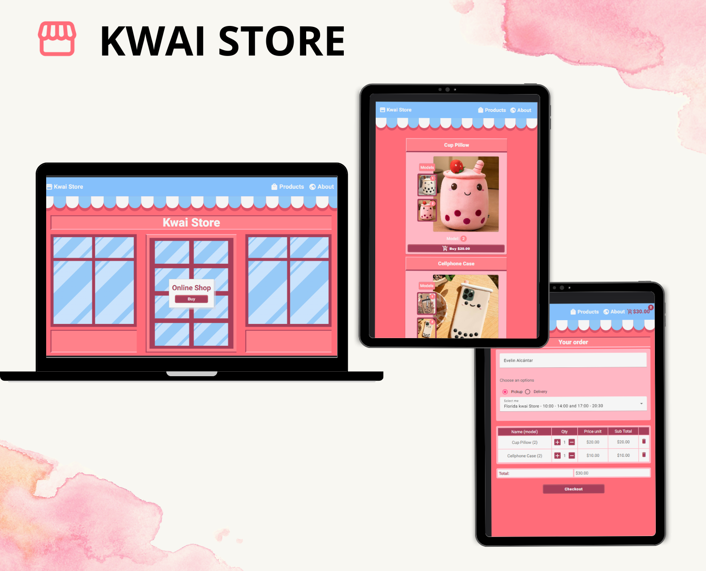

# Kwai Store

## 1. Resumen del proyecto

Es una tienda que vende productos asiáticos comúnmente llamado moda Kwai que recién está comenzando en el rubro tecnológico y necesita una aplicación para vender sus productos para recojo en tienda o para pagar en contra-entrega.

Está aplicación está diseñada para diferentes dispositivos (es responsive), con una vista personalizada pensada en el usuario.

Nuestra clienta nos ha solicitado desarrollar la interfaz que se integre con la API que otro equipo de desarrolladoras está trabajando simultáneamente.

Esta es la información que tenemos del cliente:

> Somos **Kwai Store**, una tienda que vende productos asiáticos.
>
> Que tiene registrado los siguientes productos:

> | Producto          | Precio $ | Categoría   | N° modelos |
> | ----------------- | -------- | ----------- | ---------- |
> | Cup Pillow        | 20       | home        | 2          |
> | Cellphone Case    | 10       | electronics | 2          |
> | Cups x3           | 25       | home        | 2          |
> | Diary             | 8        | toys        | 2          |
> | Flowerport        | 40       | home        | 2          |
> | Headphone Charger | 55       | electronics | 2          |
> | Lamp              | 20       | home        | 2          |
> | Pea Pillow        | 20       | teddies     | 2          |
> | Teddy in Costume  | 20       | teddies     | 2          |
>
> Y la lista de tiendas:
>
> | Store                    | address                  | city     | Opening hours                   |
> | ------------------------ | ------------------------ | -------- | ------------------------------- |
> | kwai Store at Beekman    | 38 Park Row              | New York | 10:00 - 14:00 and 17:00 - 20:30 |
> | Kwai Store Alcalá        | Calle de Alcalá, 21      | Madrid   | 10:00 - 14:00 and 17:00 - 20:30 |
> | Florida kwai Store       | 125 Gardenias San Isidro | Lima     | 10:00 - 14:00 and 17:00 - 20:30 |
> | Covent Garden Kwai Store | 10 Russell Street        | London   | 10:00 - 14:00 and 17:00 - 20:30 |
> | Monmouth St - Kwai Store | 11 Monmouth Street       | París    | 10:00 - 14:00 and 17:00 - 20:30 |

> Nuestros clientes son bastante indecisos, por lo que es muy común que cambien
> el pedido varias veces antes de finalizarlo.

La interfaz debe mostrar todos los productos y la usuaria debe poder ir eligiendo qué productos agregar y la interfaz debe ir mostrando el resumen del pedido con el costo total.

Además la clienta nos ha dado un link a la documentación que especifica el comportamiento esperado de la API HTTP que deberás consumir. Ahí puedes encontrar todos los detalles de los endpoints, como por ejemplo qué parámetros esperan, qué deben responder, etc.

## 2. Historias de usuarios

Estas son las historias de usuario solicitadas con las que se cumplió el proyecto.

### Historia de usuario 1

**Yo como dueña de la página quiero tener una vista inicial que se parezca a una tienda animada para mantener la imagen y perspectiva de la tienda.**

- El usuario puede ver la tienda animada en cualquier dispostivo.
- El usuario puede ingresar a los productos y ver las distintas secciones de la página.
- El usuario verá en vista desktop dos ventanas y una puerta que simulen la tienda animada.
- El usuario verá en vista tablet una ventana y una puerta que simulen la tienda animada.
- El usuario verá en vista móvil una puerta que simulen la tienda animada.

### Historia de usuario 2

**Yo como usuario quiero ver todos los productos de la tienda para poder comprar.**

- El usuario puede ver todos los productos renderizados
- El usuario puede acceder y cambiar a los dos modelos de productos.
- El usuario puede engrandar la imagen si está en versión desktop
- El usuario verá en pantalla un loader cuando aún no han sido cargados los productos.
- El usuario verá "sold out" si el producto está agotado

### Historia de usuario 3

**Yo como usuario quiero ver los productos añadidos al carrito para poder realizar mi pedido**

- El usuario puede ver el número de productos añadidos en el carrito en la parte superior de la página
- El usuario puede acceder al checkout de la página haciendo click en el carrito.
- El usuario puede agregar sus datos personales.
- El usuario puede escoger recojo en tienda o delivery.
- El usuario puede acceder a la lista de tiendas si quiere recoger en tienda.
- El usuario puede eliminar o agregar productos.
- El usuario puede ver el modelo de producto que escogió.

### Historia de usuario 4

**Yo como usuario quiero ver el resumen de la compra pedida para ver todos mis datos**

- El usuario puede ver su nombre en el resumen de la compra.
- El usuario puede ver la la tienda escogida o dirección que proporcionó a la hora de hacer el pedido.
- El usuario puede ver un botón que lleva a la vista principal

### Historia de usuario 5

**Yo como usuario quiero saber un poco más de kwai store para ver cuantás tiendas tiene y conocer un poco más de la marca.**

- El usuario puede acceder al botón About en la parte superior.
- El usuario puede ver el resumen de la marca kwai store
- El usuario puede ver el listado de tiendas

## Prototipo de alta fidelidad

Haz [clic aquí](https://www.figma.com/proto/1sCf031gM8McwnLNlfgTiZ/Untitled?type=design&node-id=10-3&scaling=scale-down&page-id=10%3A2&starting-point-node-id=10%3A3) o sobre la imagen para interactuar con el prototipo.

